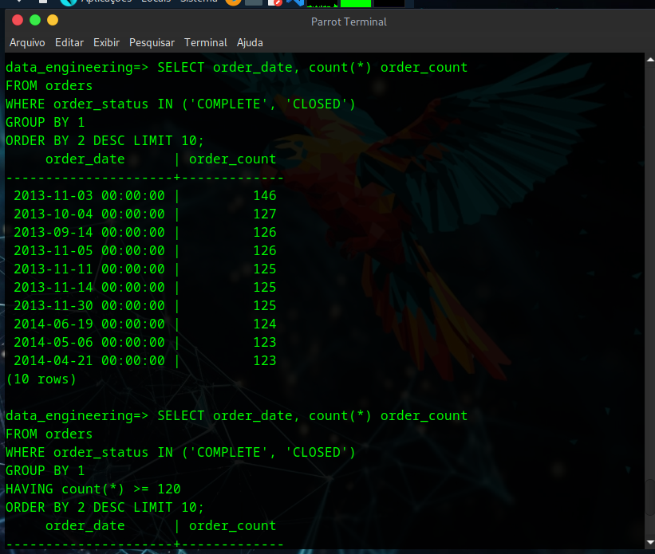

# SQL - PostgreSQL: Ordem de Execução

## Decorar vs. Entender

Durante meus estudos de transição para engenharia de dados, na linguagem SQL, desde o princípio me intrigava saber como tudo funcionava, por que funcionava, por que “isso” tem que ser “aqui” e “aquilo” tem que ser “ali”. 

Então quando eu estudava o básico, esse pensamento me veio à mente. Acredito que normalmente quem está iniciando, a primeira coisa que a pessoa quer é decorar a ordem para escrever uma query, pois é comum se confundir, como usar ORDER BY antes de GROUP BY, ou as vezes se empolgar e escrever WHERE antes de FROM.

Quando decoramos que uma consulta se escreve na ordem:
```sql
1. SELECT / DISTINCT
2. FROM / JOIN
3. WHERE
4. GROUP BY
5. HAVING
6. ORDER BY
7. LIMIT
```

Começamos a indagar: "Por que essa ordem? O código é executado nessa mesma ordem?".

---

## Ordem de escrita ≠ Ordem de execução

E não é bem assim, a ordem de execução é completamente diferente da ordem de escrita, e entender isso me fez ser mais acertivo ao escrever uma consulta, por mais básica que seja e principalmente as mais complexas. Eu particularmente começo a escrever uma consulta pela ordem de execução, pois é mais fácil manter o raciocínio ao escrever uma query mais complexa, por exemplo:
```sql
1. FROM / JOIN
2. WHERE
3. GROUP BY
4. HAVING
5. SELECT / DISTINCT
6. ORDER BY
7. LIMIT.
```

Primeiro o PostgreSQL lê os dados da tabela e carrega para a memória (buffer pool), depois a linha, depois agrupa tudo para poder filtrar, em seguida calcula e seleciona o que foi filtrado, após isso elimina as linhas duplicadas, põe em ordem a leitura da tabela e limita as linhas que serão exibidas para mostrar a consulta.

Aprendi na prática que sempre devemos limitar a quantidade de linhas a serem exibidas em uma consulta com banco de dados grande, a quantidade de memória usada para processar tudo isso, dependendo da quantidade de registros, é muito grande e limitar isso te poupa tempo.

---

## Como isso muda tudo

Acontece que, a ordem de escrita será compilada pelo PostgreSQL e transformada em plano de execução. Em seguida, esse plano será executado para processar os dados de acordo com a lógica da consulta, e os dados da tabela serão lidos na memória do servidor no qual o banco de dados está sendo executado (podemos visualizar esse plano usando o comando EXPLAIN ANALYZE). Por fim, ele começará a processar os dados.

Portanto, quando se trata de execução, ele começará pela cláusula FROM, os dados serão lidos da tabela para a memória e depois ele aplicará as condições da cláusula WHERE.

Se a tabela tiver 1.000 linhas, todas as 1.000 linhas serão lidas na memória (seja de disco ou cache), após isso, os dados serão filtrados (WHERE) e os resultados intermediários serão novamente armazenados na memória. Não importa a quantidade de registros, se estivermos consultando 3 registros na cláusula WHERE esses 3 registros serão colocados na memória, se a mesma condição mostrar 100 de 1.000 registros da tabela, esses 100 registros serão novamente armazenados na memória.

No entanto, vale mencionar uma otimização importante: se houver índices nas colunas WHERE, o PostgreSQL poderá usar uma varredura de índice para ler apenas as linhas necessárias diretamente, o que torna a consulta muito mais rápida e eficiente.

Então, todos os dados filtrados serão disponibilizados para nós na memória após a cláusula WHERE, que executará tudo o que tiver dentro de GROUP BY. 

Normalmente como parte do GROUP BY, especificamos as chaves (PK ou FK) nas quais os dados devem ser agrupados na cláusula SELECT, também podemos ter funções de agregação na cláusula SELECT além de executar a lógica em um GROUP BY que também executará o que estiver na cláusula SELECT. 

Como muitas vezes haverá dependências entre os dois, o PostgreSQL irá processar de forma integrada: o GROUP BY prepara os grupos, e o SELECT calcula as agregações (COUNT, SUM, AVG, etc) em cima desses grupos, a partir daí, o PostgreSQL executa os filtros adicionais (HAVING) ou vai direto para a ordenação dos resultados (ORDER BY), dependendo da consulta que estivermos fazendo. 

Ele classifica os dados novamente após agrupar pela chave para realizar a agregação, então temos ORDER BY classificando a saída e retornando os resultados de acordo com a lógica.

É bom lembrar que os filtros também possuem uma ordem, a cláusula WHERE filtra as linhas antes do agrupamento, a expressão HAVING filtra após o agrupamento. Entender isso nos dá uma vantagem de processamento, pois filtrar as linhas (WHERE -> FILTRA -> GROUP BY) é mais rápido do que filtrar um agrupamento (GROUP BY -> AGRUPA -> HAVING: filtra grupos). 


---

## Mapa Mental Completo

Para uma visão interativa e detalhada de toda a ordem de execução SQL, confira o mapa mental completo:

[](https://www.mindmeister.com/3919214140/sql-postgresql-execution-order)

*Clique na imagem para abrir o mapa interativo no MindMeister*

---

## Exemplo prático

Supondo que queremos ver a contagem de pedidos de uma loja por data, cujo status dos pedidos estão "COMPLETOS" e "FECHADOS":
```sql
SELECT order_date, count(*) order_count -- Usar aliases não é obrigatório
FROM orders
WHERE order_status IN ('COMPLETE', 'CLOSED')
GROUP BY 1 -- Coluna (order_date)
ORDER BY 2 DESC LIMIT 10; -- Coluna (order_count)
```


Ou pedidos estão "COMPLETOS" e "FECHADOS" acima de um determinado valor:
```sql
SELECT order_date, count(*) order_count
FROM orders
WHERE order_status IN ('COMPLETE', 'CLOSED')
GROUP BY 1
HAVING count(*) >= 120 -- Filtro para valores acima de 120 (exemplo)
ORDER BY 2 DESC LIMIT 10;
```

Para apelidar uma coluna não precisa necessariamente usar aliases (contagem). Para resumir a consulta acima: 

1. filtramos a contagem de pedidos da tabela pedidos (FROM pedidos);
2. identificamos as linhas necessárias, que filtra apenas os registros que atendem exatamente os critérios definidos entre parênteses, antes de realizar a contagem (WHERE status IN (‘COMPLETOS’, ‘FECHADO’));
3. agrupamos este filtro de acordo com a primeira coluna do SELECT (GROUP BY 1);
4. ordenamos os resultados de acordo com a segunda coluna do SELECT em ordem decrescente (ORDER BY 2 DESC;); e
5. selecionamos a(s) coluna(s) base da nossa consulta e criamos temporariamente uma nova coluna que mostrará o resultado, com um apelido (SELECT data, count(*) contagem).

O motivo de eu ter usado “1” e “2” em GROUP BY e ORDER BY é simplificar para mim, normalmente escrevemos os nomes das colunas para maior clareza. “1” representa a primeira coluna do SELECT (data) e “2” a segunda coluna (contagem).

Entender os conceitos por trás de toda escrita de códigos nos permite criar maneiras de ler, interpretar, simplificar, e se conseguimos simplificar algo, significa que entendemos, e se entendemos, não esqueceremos. 

---

## Exemplo prático detalhado (EXPLAIN ANALYZE)


## Resumindo o comando EXPLAIN ANALIZE(imagem):
```
Seq Scan: PostgreSQL leu toda a tabela (38428 linhas)  
Filter: Aplicou WHERE, removeu linhas indesejadas  
HashAggregate: Agrupou por order_date  
Filter (HAVING): Removeu 342 grupos com count >= 120  
Tempo total: ~21ms"
```